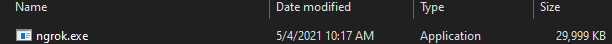
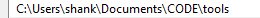
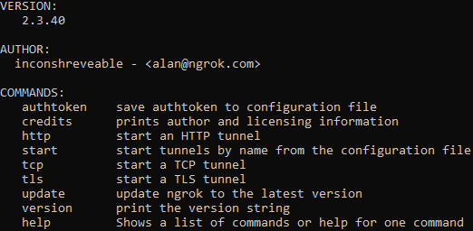
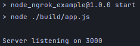
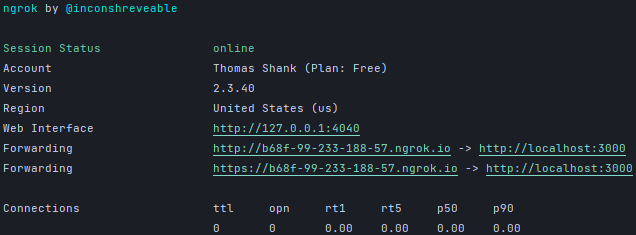

## Node, Express & Ngrok

This example uses Typescript, NodeJS, Express and Ngrok to accept post requests from external resources that require 
a valid IP Address or domain. Ngrok forwards your localhost addresses to an accessible IP Address.

From Ngrok:

Instantly create a public HTTPS url for a website running locally on your development machine. ngrok offloads TLS so you don't have to worry about your configuration.
___ 

### Setup

1. Install Ngrok by visiting their website https://ngrok.com/
2. Download and save the ngrok.exe cli tool somewhere memorable on your PC.

3. Copy the Path that points to ngrok.exe and save it under your systems PATH variable.

4. Run "ngrok" in the terminal to make sure it's locatable

5. Setup your express server on port 3000  

6. Run ngrok with commands pointing to your express server's port (Does not need to be 3000)

